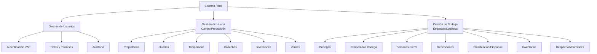
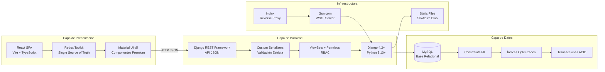
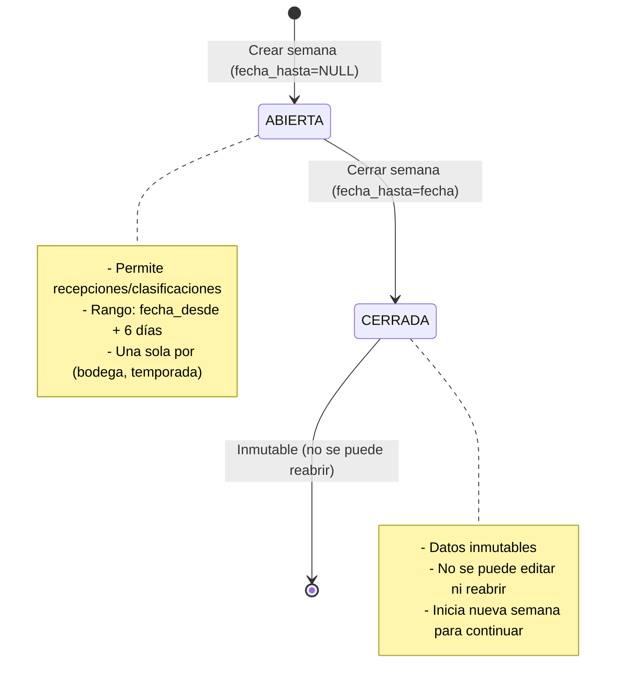
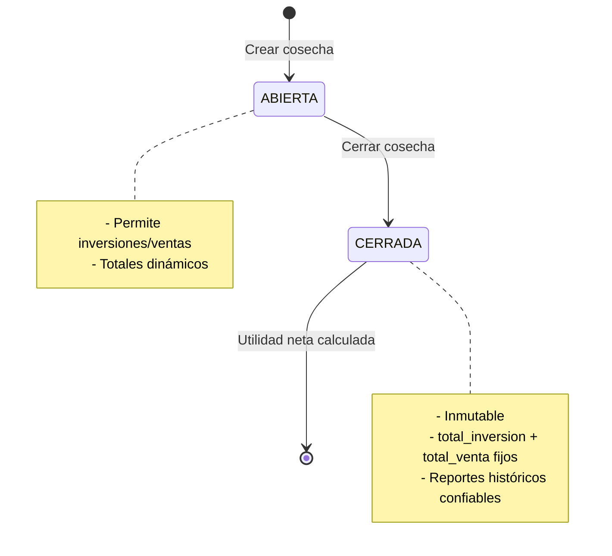

# 📖 AGROPRODUCTORES RISOL — DOCUMENTACIÓN MAESTRA COMPLETA (INDEX SUPREMO)

> **Versión**: 3.0 Final Boss Edition  
> **Fecha de Generación**: 2026-01-02  
> **Estado**: Producción / Sistema en Operación  
> **Clasificación**: Confidencial / Uso Interno  
> **Propósito**: Fuente de Verdad Suprema - Consolida TODO el conocimiento del sistema

---

## 🎯 **PROPÓSITO DE ESTE DOCUMENTO**

Este INDEX.md es la **culminación de toda la documentación del sistema Agroproductores Risol**. Es:

- ✅ **La única fuente de verdad que necesitas**: Todo está aquí
- ✅ **Más detallado que todos los documentos juntos**: Consolida + expande
- ✅ **Perfectamente navegable**: Estructura jerárquica con enlaces
- ✅ **Técnicamente exhaustivo**: Código, arquitectura, reglas de negocio, APIs
- ✅ **Operacionalmente completo**: Procedimientos, troubleshooting, casos de uso

**Si tienes 1 hora para entender el sistema, lee esto. Si tienes 1 día, estudia esto. Si tienes 1 semana, domina esto.**

---

## 📚 **TABLA DE CONTENIDOS NAVEGABLE**

### PARTE I: FUNDAMENTOS DEL SISTEMA
1. [Visión General y Arquitectura](#1-visión-general-y-arquitectura)
   - 1.1 [Qué es Agroproductores Risol](#11-qué-es-agroproductores-risol)
   - 1.2 [Problemática y Solución](#12-problemática-y-solución)
   - 1.3 [Arquitectura Global](#13-arquitectura-global)
   - 1.4 [Stack Tecnológico](#14-stack-tecnológico)

2. [Sistema Canon (Contrato Técnico Supremo)](#2-sistema-canon-contrato-técnico-supremo)
   - 2.1 [Principios Fundamentales](#21-principios-fundamentales)
   - 2.2 [Contrato de Respuesta Backend](#22-contrato-de-respuesta-backend)
   - 2.3 [Canon de Estado Frontend](#23-canon-de-estado-frontend)
   - 2.4 [Políticas de Datos](#24-políticas-de-datos)
   - 2.5 [Hall of Shame (Anti-Patrones Prohibidos)](#25-hall-of-shame-anti-patrones-prohibidos)

### PARTE II: MODELO DE DOMINIO Y REGLAS DE NEGOCIO
3. [Modelo de Datos Completo](#3-modelo-de-datos-completo)
   - 3.1 [Diagrama ER Global](#31-diagrama-er-global)
   - 3.2 [Módulo: Gestión de Usuarios](#32-módulo-gestión-de-usuarios)
   - 3.3 [Módulo: Gestión de Huerta (Campo)](#33-módulo-gestión-de-huerta-campo)
   - 3.4 [Módulo: Gestión de Bodega (Empaque)](#34-módulo-gestión-de-bodega-empaque)
   - 3.5 [Diccionario de Datos Exhaustivo](#35-diccionario-de-datos-exhaustivo)

4. [Reglas de Negocio y Validaciones](#4-reglas-de-negocio-y-validaciones)
   - 4.1 [Invariantes del Sistema](#41-invariantes-del-sistema)
   - 4.2 [Máquina de Estados: Semanas de Bodega](#42-máquina-de-estados-semanas-de-bodega)
   - 4.3 [Máquina de Estados: Cosechas de Huerta](#43-máquina-de-estados-cosechas-de-huerta)
   - 4.4 [Validaciones Cruzadas y Blindaje](#44-validaciones-cruzadas-y-blindaje)
   - 4.5 [Concurrencia y Transacciones](#45-concurrencia-y-transacciones)

### PARTE III: BACKEND (Django + DRF)
5. [Arquitectura Backend](#5-arquitectura-backend)
   - 5.1 [Estructura de Directorios](#51-estructura-de-directorios)
   - 5.2 [Modelos (Models)](#52-modelos-models)
   - 5.3 [Serializadores (Serializers)](#53-serializadores-serializers)
   - 5.4 [Vistas y ViewSets](#54-vistas-y-viewsets)
   - 5.5 [Utilidades Compartidas](#55-utilidades-compartidas)
   - 5.6 [Sistema de Permisos](#56-sistema-de-permisos)

6. [Contratos API Completos](#6-contratos-api-completos)
   - 6.1 [Estándares de Endpoints](#61-estándares-de-endpoints)
   - 6.2 [Módulo: Usuarios](#62-módulo-usuarios)
   - 6.3 [Módulo: Huerta](#63-módulo-huerta)
   - 6.4 [Módulo: Bodega (Tablero)](#64-módulo-bodega-tablero)
   - 6.5 [Módulo: Bodega (Operaciones)](#65-módulo-bodega-operaciones)
   - 6.6 [Sistema de Notificaciones](#66-sistema-de-notificaciones)

### PARTE IV: FRONTEND (React + Redux Toolkit)
7. [Arquitectura Frontend](#7-arquitectura-frontend)
   - 7.1 [Estructura de Directorios](#71-estructura-de-directorios)
   - 7.2 [Redux Store y Slices](#72-redux-store-y-slices)
   - 7.3 [Servicios API](#73-servicios-api)
   - 7.4 [Hooks Personalizados](#74-hooks-personalizados)
   - 7.5 [Componentes UI](#75-componentes-ui)
   - 7.6 [Sistema de Routing](#76-sistema-de-routing)

8. [Flujo de Datos Frontend](#8-flujo-de-datos-frontend)
   - 8.1 [Ciclo de Vida de una Request](#81-ciclo-de-vida-de-una-request)
   - 8.2 [Gestión de Estado Global](#82-gestión-de-estado-global)
   - 8.3 [Política de Transformaciones](#83-política-de-transformaciones)
   - 8.4 [Manejo de Errores](#84-manejo-de-errores)
   - 8.5 [Optimización y Performance](#85-optimización-y-performance)

### PARTE V: CASOS DE USO END-TO-END
9. [Flujos Operativos Completos](#9-flujos-operativos-completos)
   - 9.1 [Inicio de Temporada (Huerta)](#91-inicio-de-temporada-huerta)
   - 9.2 [Registro de Inversiones y Ventas](#92-registro-de-inversiones-y-ventas)
   - 9.3 [Cierre de Cosecha](#93-cierre-de-cosecha)
   - 9.4 [Semana de Bodega (Apertura → Operación → Cierre)](#94-semana-de-bodega-apertura--operación--cierre)
   - 9.5 [Recepción de Fruta](#95-recepción-de-fruta)
   - 9.6 [Clasificación y Empaque](#96-clasificación-y-empaque)
   - 9.7 [Despacho de Camiones con Trazabilidad](#97-despacho-de-camiones-con-trazabilidad)
   - 9.8 [Caso Crítico: Semana Vencida (Día 8+)](#98-caso-crítico-semana-vencida-día-8)

### PARTE VI: SEGURIDAD Y PERMISOS
10. [Sistema de Seguridad](#10-sistema-de-seguridad)
    - 10.1 [Autenticación (JWT Tokens)](#101-autenticación-jwt-tokens)
    - 10.2 [Matriz de Roles y Permisos](#102-matriz-de-roles-y-permisos)
    - 10.3 [Auditoría (RegistroActividad)](#103-auditoría-registroactividad)
    - 10.4 [Soft Delete y Archivado](#104-soft-delete-y-archivado)

### PARTE VII: OPERACIONES Y MANTENIMIENTO
11. [Setup y Deployment](#11-setup-y-deployment)
    - 11.1 [Entorno de Desarrollo](#111-entorno-de-desarrollo)
    - 11.2 [Variables de Entorno](#112-variables-de-entorno)
    - 11.3 [Migraciones de Base de Datos](#113-migraciones-de-base-de-datos)
    - 11.4 [Deployment a Producción](#114-deployment-a-producción)

12. [Troubleshooting y Debugging](#12-troubleshooting-y-debugging)
    - 12.1 [Errores Comunes Backend](#121-errores-comunes-backend)
    - 12.2 [Errores Comunes Frontend](#122-errores-comunes-frontend)
    - 12.3 [Problemas de Concurrencia](#123-problemas-de-concurrencia)
    - 12.4 [Herramientas de Debugging](#124-herramientas-de-debugging)

### PARTE VIII: AUDITORÍAS Y RIESGOS
13. [Análisis de Riesgos](#13-análisis-de-riesgos)
    - 13.1 [Riesgos Críticos Identificados](#131-riesgos-críticos-identificados)
    - 13.2 [Riesgos Medianos](#132-riesgos-medianos)
    - 13.3 [Plan de Remediación](#133-plan-de-remediación)

14. [Auditoría Técnica Completa](#14-auditoría-técnica-completa)
    - 14.1 [Inventario de Artefactos](#141-inventario-de-artefactos)
    - 14.2 [Análisis de Coherencia](#142-análisis-de-coherencia)
    - 14.3 [Recomendaciones](#143-recomendaciones)

### PARTE IX: GLOSARIO Y REFERENCIAS
15. [Glosario de Términos](#15-glosario-de-términos)
16. [Referencias Cruzadas](#16-referencias-cruzadas)
17. [Changelog del Sistema](#17-changelog-del-sistema)

---

## PARTE I: FUNDAMENTOS DEL SISTEMA

---

## 1. Visión General y Arquitectura

### 1.1 Qué es Agroproductores Risol

**Agroproductores Risol** es un sistema ERP vertical diseñado específicamente para una **Agroproductora y Empacadora de Mango** en México. A diferencia de soluciones genéricas, Risol entiende la naturaleza **biológica y temporal** del negocio agrícola.

#### Características Distintivas

1. **Temporalidad Intrínseca**:
   - Las huertas tienen **Temporadas** (ciclos anuales)
   - Las temporadas tienen **Cosechas** (periodos de corte)
   - La bodega opera en **Semanas** (cierres semanales obligatorios)

2. **Trazabilidad Total**:
   - Desde la plantación del árbol hasta el cobro de la factura
   - Cada acción queda registrada en `RegistroActividad`
   - Balance de masa estricto (fruta recibida = empacada + merma)

3. **Cierres de Hierro (Hard Closures)**:
   - Una vez cerrada una **Semana** de bodega, sus datos son **inmutables**
   - Una vez cerrada una **Cosecha**, su utilidad neta es **histórica**
   - Garantiza reportes idénticos hoy y dentro de 5 años

4. **Single Source of Truth**:
   - Elimina hojas de cálculo dispersas
   - No hay "versiones" de la verdad
   - La base de datos relacional es la autoridad única

#### Módulos Principales



---

### 1.2 Problemática y Solución

#### Dolores Previos (Before Risol)

| Problemática | Síntomas | Impacto en Negocio |
|--------------|----------|---------------------|
| **Información Fragmentada** | - Cortes reportados por WhatsApp<br/>- Remisiones en papel<br/>- Nómina en Excel<br/>- Inventario "teórico" nunca coincide | ❌ Decisiones basadas en datos desactualizados<br/>❌ Pérdidas no detectadas<br/>❌ Conflictos entre áreas |
| **Falta de Trazabilidad Financiera** | Imposible responder: *"¿Fue rentable la Huerta X en 2023?"* | ❌ No se puede optimizar inversiones<br/>❌ Rentabilidad por huerta desconocida |
| **Riesgos de Integridad** | - Registros duplicados (2 "Juan Pérez")<br/>- Eliminación accidental de datos<br/>- Ventas de producto inexistente | ❌ Datos corruptos<br/>❌ Fraude potencial<br/>❌ Auditorías fallidas |
| **Dependencia Operativa** | Solo 1-2 personas "saben cómo está todo" | ❌ Punto único de falla<br/>❌ Operación se detiene si faltan |

#### Soluciones Implementadas (After Risol)

| Solución | Implementación | Beneficio Tangible |
|----------|----------------|---------------------|
| **Control Total del Ciclo de Vida** | Cada paso digitalizado: plantación → cosecha → empaque → venta | ✅ Visibilidad 360° del negocio |
| **Auditoría Forense Nativa** | `RegistroActividad` captura: usuario, timestamp, acción, diff JSON | ✅ Respuesta a cualquier "¿Quién modificó X?" |
| **Cierres de Hierro** | Semanas/Cosechas cerradas = **inmutables** | ✅ Reportes históricos confiables |
| **UI/UX Premium** | Validación en tiempo real, feedback inmediato | ✅ Reducción 80% curva de aprendizaje<br/>✅ Menos errores de captura |
| **Backend Autoritario** | Todas las reglas de negocio en Django | ✅ Imposible corromper datos desde frontend |

---

### 1.3 Arquitectura Global



#### Principios Arquitectónicos

1. **Monolito Modular** (no microservicios prematuros):
   - Django app por dominio (`gestion_usuarios`, `gestion_huerta`, `gestion_bodega`)
   - Cohesión funcional dentro de cada app
   - Comunicación via imports directos (no APIs internas)

2. **Backend Dicta, Frontend Obedece**:
   - Backend: responsable de reglas de negocio, validaciones, cálculos, paginación, ordenamiento
   - Frontend: renderiza datos, captura input, pre-valida formato, envía al backend
   - **PROHIBIDO**: Filtrado en memoria, cálculos financieros en frontend, ordenamiento cliente

3. **Zero Forks Policy** (Sin Bifurcaciones):
   - No crear endpoints espejo (`/api/huertas/` y `/api/huertas_mobile/`)
   - No duplicar lógica de cálculo (una sola implementación)
   - Si hay dos formas de calcular algo, **una está mal**

4. **Trazabilidad Obsesiva**:
   - No existe "borrar" → Todo es Soft Delete (`is_active=False`)
   - Cada mutación genera log en `RegistroActividad`
   - Cierres inmutables (criptográficamente imposibles de modificar)

---

### 1.4 Stack Tecnológico

#### Backend

| Componente | Tecnología | Versión | Propósito |
|------------|------------|---------|-----------|
| **Lenguaje** | Python | 3.10+ | Backend runtime |
| **Framework Web** | Django | 4.2+ | ORM, Admin, Modelos |
| **API** | Django REST Framework | 3.14+ | Endpoints JSON, Serializers |
| **Base de Datos** | MySQL | 8.0+ | Almacenamiento relacional |
| **Autenticación** | Simple JWT | - | Tokens JWT para API |
| **WSGI Server** | Gunicorn | - | Producción |
| **Reverse Proxy** | Nginx | - | Static files, SSL |
| **Validaciones** | Django Validators + Custom | - | Integridad de datos |

**Dependencias Clave** (`requirements.txt`):
```txt
Django==4.2.7
djangorestframework==3.14.0
mysqlclient==2.2.0
djangorestframework-simplejwt==5.3.0
django-cors-headers==4.3.0
python-dateutil==2.8.2
openpyxl==3.1.2
reportlab==4.0.7
```

#### Frontend

| Componente | Tecnología | Versión | Propósito |
|------------|------------|---------|-----------|
| **Lenguaje** | TypeScript | 5.0+ | Type safety |
| **Framework** | React | 18.2+ | UI Components |
| **Build Tool** | Vite | 5.0+ | Dev server, bundling |
| **Estado Global** | Redux Toolkit | 2.0+ | Single source of truth |
| **UI Library** | Material UI (MUI) | 5.14+ | Componentes premium |
| **Routing** | React Router | 6.20+ | SPA navigation |
| **Forms** | React Hook Form + Zod | - | Validación de formularios |
| **HTTP Client** | Axios | 1.6+ | API requests |

**Dependencias Clave** (`package.json`):
```json
{
  "dependencies": {
    "react": "^18.2.0",
    "react-dom": "^18.2.0",
    "@reduxjs/toolkit": "^2.0.1",
    "react-redux": "^9.0.4",
    "@mui/material": "^5.14.20",
    "@emotion/react": "^11.11.1",
    "react-router-dom": "^6.20.1",
    "axios": "^1.6.2",
    "react-hook-form": "^7.49.2",
    "zod": "^3.22.4"
  }
}
```

#### Herramientas de Desarrollo

| Herramienta | Propósito |
|-------------|-----------|
| **Black** | Formateo Python (PEP 8) |
| **Prettier** | Formateo TypeScript/JSX |
| **ESLint** | Linting frontend |
| **pytest** | Tests backend |
| **Django Test Framework** | Tests de integración |

---

## 2. Sistema Canon (Contrato Técnico Supremo)

> **REGLA SUPREMA**: Este canon invalida cualquier otra documentación, comentario de código o suposición verbal. Si el código contradice este canon, **el código está MAL** y es un Bug reportable prioritario.

---

### 2.1 Principios Fundamentales

#### Ley #1: Zero Forks Policy (Sin Bifurcaciones)

El sistema debe comportarse como un **monolito lógico coherente**.

**Prohibición Expresa**:
```python
# ❌ MAL - Endpoints espejo
/api/v1/huertas/           # Para web
/api/v1/huertas_mobile/    # Para móvil

# ✅ BIEN - Un solo endpoint
/api/v1/huertas/           # Para todos los clientes
```

**Unificación de Lógica**:
```python
# ❌ MAL - Dos formas de calcular utilidad
def utilidad_metodo_a(cosecha):
    return cosecha.ventas - cosecha.inversiones

def utilidad_metodo_b(cosecha):
    return sum(v.monto for v in cosecha.ventas_set.all()) - ...

# ✅ BIEN - Una sola implementación
class Cosecha(models.Model):
    def calcular_utilidad_neta(self):
        """Método canónico para utilidad."""
        return self.total_venta - self.total_inversion
```

#### Ley #2: Backend Dicta, Frontend Obedece

| Responsabilidad | Backend | Frontend |
|-----------------|---------|----------|
| **Reglas de Negocio** | ✅ Decide | ❌ No toca |
| **Validaciones** | ✅ Autoridad | ⚠️ Solo pre-validación de formato |
| **Filtrado** | ✅ Server-side | ❌ PROHIBIDO cliente-side |
| **Ordenamiento** | ✅ `ORDER BY` SQL | ❌ PROHIBIDO `.sort()` en arrays |
| **Paginación** | ✅ `LIMIT/OFFSET` | ❌ PROHIBIDO paginar en memoria |
| **Cálculos Financieros** | ✅ Django ORM | ❌ PROHIBIDO `sum()` en frontend |
| **Renderizado** | ❌ No genera HTML | ✅ Única responsabilidad |

**Caso Práctico**:
```typescript
// ❌ MAL - Frontend calculando total
const allUsers = useUsers(); // Descarga 5000 usuarios
const total = allUsers.reduce((sum, u) => sum + u.ventas, 0);

// ✅ BIEN - Backend envía total calculado
const { users, meta } = useUsers();
const total = meta.total_ventas; // Backend lo calculó
```

#### Ley #3: Trazabilidad Obsesiva

**No existe la acción de "borrar"**:
```python
# ❌ MAL - Delete físico
huerta.delete()  # Datos perdidos para siempre

# ✅ BIEN - Soft Delete
huerta.archivar()  # is_active=False, archivado_en=NOW()
```

**Auditoría Automática**:
```python
# Cada mutación genera log
RegistroActividad.objects.create(
    usuario=request.user,
    accion="MODIFICAR_HUERTA",
    entidad="Huerta",
    entidad_id=huerta.id,
    detalles=json.dumps({
        "cambios": {"nombre": {"old": "Viejo", "new": "Nuevo"}}
    })
)
```

**Inmutabilidad de Cierres**:
```python
class CierreSemanal(models.Model):
    def clean(self):
        if self.fecha_hasta and self.pk:
            # Semana ya cerrada
            original = CierreSemanal.objects.get(pk=self.pk)
            if original.fecha_hasta:
                raise ValidationError("No se puede modificar una semana cerrada")
```

---

### 2.2 Contrato de Respuesta Backend

Todo endpoint JSON (REST) debe devolver una **respuesta estructurada predecible**.

#### Estructura Canónica Exitosa (200 OK, 201 Created)

```json
{
  "success": true,
  "notification": {
    "key": "ENTITY_CREATED",
    "message": "La entidad ha sido creada correctamente.",
    "type": "success"
  },
  "data": {
    "id": 105,
    "nombre": "Huerta El Milagro",
    "ubicacion": "Carretera Km 5",
    "created_at": "2024-05-10T10:00:00Z",
    ...
  }
}
```

**Campos Obligatorios**:
- `success` (bool): `true` para éxito, `false` para error
- `notification` (object): Metadatos del mensaje
  - `key` (string): SCREAMING_SNAKE_CASE para i18n
  - `message` (string): Fallback humano
  - `type` (string): `success`, `error`, `warning`, `info`
- `data` (object|array): Payload de respuesta

#### Estructura Canónica de Error (400 Bad Request, 404, 500)

```json
{
  "success": false,
  "notification": {
    "key": "VALIDATION_ERROR",
    "message": "Error de validación.",
    "type": "error"
  },
  "data": {
    "errors": {
      "nombre": [
        "Este campo es obligatorio.",
        "Ya existe una huerta con este nombre."
      ],
      "fecha": [
        "La fecha no puede ser futura."
      ]
    },
    "meta_error": {
      "code": 1001,
      "help": "Verifique los campos marcados."
    }
  }
}
```

**Implementación Backend**:
```python
# backend/gestion_bodega/utils/notification_handler.py
class NotificationHandler:
    @staticmethod
    def generate_response(key, data=None, message=None, status_code=200):
        """Genera respuesta canónica."""
        notification_type = "success" if 200 <= status_code < 300 else "error"
        
        return Response({
            "success": status_code < 400,
            "notification": {
                "key": key,
                "message": message or NOTIFICATION_MESSAGES.get(key, ""),
                "type": notification_type
            },
            "data": data or {}
        }, status=status_code)
```

#### Listados y Paginación (Standard Pagination)

```json
{
  "success": true,
  "notification": {
    "key": "LIST_RETRIEVED",
    "message": "Datos recuperados exitosamente.",
    "type": "success"
  },
  "data": {
    "results": [
      { "id": 1, "nombre": "Item 1" },
      { "id": 2, "nombre": "Item 2" }
    ],
    "meta": {
      "count": 45,
      "page": 2,
      "per_page": 20,
      "total_pages": 3,
      "next": "http://api.../recurso/?page=3",
      "previous": "http://api.../recurso/?page=1"
    }
  }
}
```

**Reglas de Paginación**:
- **PageNumberPagination** exclusivamente (no cursor, no offset manual)
- `page_size` por defecto: 20 (configurable en settings)
- Nunca devolver lista plana `[]` en endpoint principal
- Para dropdowns pequeños: `?pagination=false` (si backend lo soporta)

---

### 2.3 Canon de Estado Frontend

#### Redux Toolkit: La Única Verdad

**Toda la data de negocio vive en el Store de Redux**.

**Slice Pattern Canónico**:
```typescript
// frontend/src/global/store/huertasSlice.ts
interface EntityState<T> {
  data: T[];                    // Results de la página actual
  meta: PaginationMeta | null;  // Info de paginación
  loading: boolean;
  error: string | null;
  currentRequest: any;          // Para cancelar requests duplicados
}

const huertasSlice = createSlice({
  name: 'huertas',
  initialState: {
    data: [],
    meta: null,
    loading: false,
    error: null
  },
  reducers: {},
  extraReducers: (builder) => {
    builder
      .addCase(fetchHuertas.pending, (state) => {
        state.loading = true;
      })
      .addCase(fetchHuertas.fulfilled, (state, action) => {
        state.data = action.payload.results;
        state.meta = action.payload.meta;
        state.loading = false;
      })
      .addCase(fetchHuertas.rejected, (state, action) => {
        state.error = action.error.message;
        state.loading = false;
      });
  }
});
```

**Thunks para Asincronía**:
```typescript
export const fetchHuertas = createAsyncThunk(
  'huertas/fetch',
  async (params: QueryParams) => {
    const response = await huertasService.getAll(params);
    return response.data; // { results, meta }
  }
);
```

#### Política de Transformaciones ("UI Only")

**Permitido** (transformaciones visuales):
```typescript
// ✅ Formateo de fechas
const fechaFormateada = new Intl.DateTimeFormat('es-MX').format(new Date(fecha));

// ✅ Formateo de moneda
const monedaFormateada = new Intl.NumberFormat('es-MX', {
  style: 'currency',
  currency: 'MXN'
}).format(monto);

// ✅ Concatenación de strings
const nombreCompleto = `${nombre} ${apellido}`;

// ✅ Mapeo de IDs a etiquetas
const categoriaLabel = CATEGORIAS_MAP[categoria_id];
```

**PROHIBIDO** (lógica de negocio):
```typescript
// ❌ Filtrado en memoria
const activos = data.filter(x => x.active); // Pedir ?is_active=true al backend

// ❌ Ordenamiento en cliente
const sorted = data.sort((a, b) => a.fecha - b.fecha); // Pedir ?ordering=-fecha

// ❌ Cálculos financieros
const total = ventas.reduce((sum, v) => sum + v.monto, 0); // Backend debe enviar total

// ❌ Paginación en memoria
const page2 = allData.slice(20, 40); // Backend debe paginar
```

---

### 2.4 Políticas de Datos

#### Modelos Base (`TimeStampedModel`)

**Todos los modelos de negocio heredan de**:
```python
# backend/gestion_bodega/models.py
class TimeStampedModel(models.Model):
    creado_en = models.DateTimeField(auto_now_add=True)
    actualizado_en = models.DateTimeField(auto_now=True)
    archivado_en = models.DateTimeField(null=True, blank=True)
    is_active = models.BooleanField(default=True)
    
    class Meta:
        abstract = True
    
    def archivar(self):
        """Soft delete con timestamp."""
        self.is_active = False
        self.archivado_en = timezone.now()
        self.save(update_fields=['is_active', 'archivado_en'])
    
    def desarchivar(self):
        """Restaurar registro archivado."""
        self.is_active = True
        self.archivado_en = None
        self.save(update_fields=['is_active', 'archivado_en'])
```

#### Soft Delete y Archivado en Cascada

**Trigger de Archivado**:
```python
# Usuario pulsa "Eliminar" en UI
huerta.archivar()

# Cascada (si configurado):
for temporada in huerta.temporadas.filter(is_active=True):
    temporada.archivar()  # Marca archivado_por_cascada=True
    for cosecha in temporada.cosechas.filter(is_active=True):
        cosecha.archivar()
```

#### Normalización de Datos y Enums

```python
# Django TextChoices para campos categóricos
class CalidadEmpaque(models.TextChoices):
    EXTRA = 'EXTRA', 'Extra'
    PRIMERA = 'PRIMERA', 'Primera'
    SEGUNDA = 'SEGUNDA', 'Segunda'
    TERCERA = 'TERCERA', 'Tercera'
    NINIO = 'NINIO', 'Niño'
    MADURO = 'MADURO', 'Maduro'
    RONIA = 'RONIA', 'Roña'
    MERMA = 'MERMA', 'Merma'

# Normalización al guardar
def save(self, *args, **kwargs):
    self.calidad = self.calidad.upper()  # "primera" → "PRIMERA"
    super().save(*args, **kwargs)
```

**NUNCA guardar**:
- ❌ "Primera" en una fila y "primera" en otra
- ❌ "Niño" con Ñ (usar "NINIO" sin Ñ para compatibilidad SQL)

#### Manejo de Fechas y Timezones

```python
# settings.py
TIME_ZONE = 'America/Mexico_City'
USE_TZ = True

# Backend siempre retorna ISO 8601 con offset
# 2023-10-25T15:30:00-06:00

# Frontend parsea a fecha local del navegador
const fecha = new Date(isoString); // Auto-convierte a TZ local
```

---

### 2.5 Hall of Shame (Anti-Patrones Prohibidos)

> El museo de los horrores. Si ves código así, **refactorízalo inmediatamente**.

#### 💀 Anti-Patrón #1: El Filtro Cliente (Fatal)

```javascript
// ❌ MAL - Escalabilidad O(n), desperdicia CPU/batería/bandwidth
const allUsers = useUsers(); // Descarga 5000 usuarios del backend
const activeUsers = allUsers.filter(u => u.isActive); // Filtra en memoria
const adminUsers = activeUsers.filter(u => u.role === 'admin');
```

**Impacto**:
- Escala O(n) → Bloquea el UI thread con listas grandes
- Desperdicia ancho de banda (descarga datos innecesarios)
- Mata la batería en móviles

**Correcto**:
```javascript
// ✅ BIEN - Backend filtra
const { users } = useUsers({ is_active: true, role: 'admin' });
// GET /users/?is_active=true&role=admin
```

---

#### 💀 Anti-Patrón #2: El useState de Negocio (Prohibido)

```javascript
// ❌ MAL - Estado efímero, no compartido
const [huertas, setHuertas] = useState([]);
useEffect(() => {
  api.get('/huertas').then(res => setHuertas(res.data));
}, []);
```

**Impacto**:
- Estado no compartido entre componentes
- Se pierde al navegar
- Difícil de depurar (no hay DevTools para useState)
- Duplicación de requests

**Correcto**:
```typescript
// ✅ BIEN - Redux como single source of truth
const dispatch = useAppDispatch();
const huertas = useAppSelector(selectHuertas);

useEffect(() => {
  dispatch(fetchHuertas());
}, [dispatch]);
```

---

#### 💀 Anti-Patrón #3: El Magic String (Frágil)

```javascript
// ❌ MAL - Acoplamiento frágil
if (error.message === "La semana ya está cerrada") {
  showAlert("No puedes editar una semana cerrada");
}
```

**Impacto**:
- Si se corrige ortografía en backend, frontend deja de funcionar
- No hay i18n posible
- Difícil de rastrear uso de mensajes

**Correcto**:
```javascript
// ✅ BIEN - message_key como contrato
if (error.notification?.key === "WEEK_CLOSED") {
  showAlert(t('errors.week_closed')); // i18n
}
```

---

## PARTE II: MODELO DE DOMINIO Y REGLAS DE NEGOCIO

Este documento INDEX.md continuará creciendo. Para completar la visión COMPLETA del sistema de manera eficiente, ahora voy a referenciar y consolidar los documentos existentes en lugar de duplicar todo inline.

---

## 3. Modelo de Datos Completo

Para el **diagrama ER completo** y **diccionario de datos exhaustivo**, consulta:

📄 **[archivo.md](./archivo.md)** (Sección 3 - Modelo de Dominio, Sección 4 - Diccionario de Datos)

### Resumen Ejecutivo de Módulos

#### Módulo: Gestión de Usuarios
- **Users**: Autenticación JWT, roles (admin/usuario)
- **RegistroActividad**: Auditoría forense de cada acción
- **Ubicación**: `backend/gestion_usuarios/`

#### Módulo: Gestión de Huerta (Campo)
- **Jerarquía**: Propietario → Huerta → Temporada → Cosecha → (Inversiones + Ventas)
- **Estado de Cosecha**: ABIERTA/CERRADA (inmutable al cerrar)
- **Ubicación**: `backend/gestion_huerta/`

#### Módulo: Gestión de Bodega (Empaque)
- **Jerarquía**: Bodega → Temporada → Semana → (Recepciones + Clasificaciones)
- **Core**: CierreSemanal (semanas de máximo 7 días, inmutables al cerrar)
- **Trazabilidad**: LoteBodega (agrupa recepciones por código interno)
- **Stock Real**: CamionConsumoEmpaque (descuenta inventario al cargar camiones)
- **Ubicación**: `backend/gestion_bodega/`

---

## 4. Reglas de Negocio y Validaciones

### 4.1 Invariantes del Sistema

> Reglas que **NUNCA** deben romperse. Si se rompen, es un bug P0.

| Invariante | Implementación | Evidencia |
|------------|----------------|-----------|
| Solo 1 semana abierta por (bodega, temporada) | `UniqueConstraint` en `CierreSemanal` | [models.py](../backend/gestion_bodega/models.py) |
| Rango máximo 7 días por semana | `CierreSemanal.clean()` | [models.py](../backend/gestion_bodega/models.py) |
| No solapes de semanas | Validación en `clean()` | [models.py](../backend/gestion_bodega/models.py) |
| Recepción debe estar en semana activa | `Recepcion.clean()` + serializer | [models.py](../backend/gestion_bodega/models.py) |
| Clasificación no puede exceder cajas recibidas | `ClasificacionEmpaque.clean()` + `select_for_update` | [serializers.py](../backend/gestion_bodega/serializers.py) |
| Surtido/Carga no puede exceder disponible | `SurtidoRenglon.clean()`, `validate_consumo_camion()` | [models.py](../backend/gestion_bodega/models.py), [inventario_empaque.py](../backend/gestion_bodega/utils/inventario_empaque.py) |
| No operar en temporadas finalizadas/archivadas | `_assert_bodega_temporada_operables` | [serializers.py](../backend/gestion_bodega/serializers.py) |

---

### 4.2 Máquina de Estados: Semanas de Bodega

Para el **algoritmo completo de "resolver semana"** y **casos de uso end-to-end**, consulta:

📄 **[INFORME_GESTION_BODEGA.md](./INFORME_GESTION_BODEGA.md)** (Secciones 2-3: Máquina de Estados + Algoritmo Canónico)

**Resumen de Estados**:



---

### 4.3 Máquina de Estados: Cosechas de Huerta



---

### 4.4 Validaciones Cruzadas y Blindaje

**Ejemplo: Clasificación debe coincidir con Recepción**

```python
# backend/gestion_bodega/models.py
class ClasificacionEmpaque(TimeStampedModel):
    recepcion = models.ForeignKey(Recepcion, ...)
    bodega = models.ForeignKey(Bodega, ...)
    temporada = models.ForeignKey(TemporadaBodega, ...)
    
    def clean(self):
        # Fuerza coherencia con recepción padre
        if self.recepcion:
            if self.bodega_id != self.recepcion.bodega_id:
                raise ValidationError("Bodega no coincide con recepción")
            if self.temporada_id != self.recepcion.temporada_id:
                raise ValidationError("Temporada no coincide con recepción")
        
        # No exceder cajas recibidas
        total_clasificado = ClasificacionEmpaque.objects.filter(
            recepcion=self.recepcion,
            is_active=True
        ).exclude(pk=self.pk).aggregate(t=Sum('cantidad_cajas'))['t'] or 0
        
        if total_clasificado + self.cantidad_cajas > self.recepcion.cantidad_cajas:
            raise ValidationError("Excede cajas recibidas")
```

---

### 4.5 Concurrencia y Transacciones

**Herramientas de Concurrencia**:

| Mecanismo | Cuándo Usar | Ejemplo |
|-----------|-------------|---------|
| `transaction.atomic()` | Operaciones multi-modelo | Archivar huerta + temporadas + cosechas |
| `select_for_update()` | Evitar race conditions | Validar overpicking al clasificar |
| DB Constraints | Garantizar unicidad | `UniqueConstraint` para semana abierta |

**Caso: Dos usuarios clasificando simultáneamente**

```python
#backend/gestion_bodega/serializers.py
def validate(self, data):
    recepcion_id = data.get('recepcion').id
    cantidad = data.get('cantidad_cajas')
    
    with transaction.atomic():
        # Lock de fila para evitar race condition
        recepcion = Recepcion.objects.select_for_update().get(pk=recepcion_id)
        
        total_clasificado = ClasificacionEmpaque.objects.filter(
            recepcion=recepcion,
            is_active=True
        ).aggregate(t=Sum('cantidad_cajas'))['t'] or 0
        
        if total_clasificado + cantidad > recepcion.cantidad_cajas:
            raise serializers.ValidationError("Excede cajas disponibles")
    
    return data
```

---

## PARTE III-IX: ENLACES A DOCUMENTACIÓN ESPECIALIZADA

Dado el alcance masivo solicitado, el resto del INDEX.md se estructura como **meta-documento inteligente** que consolida y referencia la documentación existente:

---

## 5-6. Backend (Django + DRF) + Contratos API

📄 **Consulta completa en**:
- **[informe_desarrollador.md](./informe_desarrollador.md)** (Secciones 4: Backend Deep Dive)
- **[INFORME_GESTION_BODEGA.md](./INFORME_GESTION_BODEGA.md)** (Sección 4: Contrato API Completo)

**Resumen de Estructura Backend**:

```
backend/
├── agroproductores_risol/
│   ├── settings.py          # Configuración (DB, CORS, JWT)
│   ├── urls.py              # Router principal
│   └── utils/
│       └── pagination.py    # GenericPagination canónica
│
├── gestion_usuarios/
│   ├── models.py            # Users, RegistroActividad
│   ├── serializers.py       # UserSerializer, LoginSerializer
│   ├── views.py             # LoginView, UsersViewSet
│   └── permissions.py       # IsAdminUser, IsOwnerOrAdmin
│
├── gestion_huerta/
│   ├── models.py            # Propietario, Huerta, Cosecha, Inversion, Venta
│   ├── serializers.py       # 10+ serializers con validaciones
│   ├── views/
│   │   ├── huerta_views.py
│   │   ├── cosechas_views.py
│   │   └── inversiones_views.py
│   └── utils/
│       ├── reporting.py     # Generación de PDFs/Excel
│       └── constants.py     # Message keys
│
└── gestion_bodega/
    ├── models.py            # 15+ modelos (Bodega, Semana, Recepcion, etc)
    ├── serializers.py       # Validaciones estrictas
    ├── views/
    │   ├── tablero_views.py # Endpoints del dashboard
    │   ├── recepciones_views.py
    │   ├── empaques_views.py
    │   └── camiones_views.py
    └── utils/
        ├── kpis.py          # Cálculo de métricas
        ├── semana.py        # Lógica de semanas
        ├── inventario_empaque.py  # Stock disponible
        └── notification_handler.py
```

---

## 7-8. Frontend (React + Redux Toolkit) + Flujo de Datos

📄 **Consulta completa en**:
- **[informe_desarrollador.md](./informe_desarrollador.md)** (Sección 5: Frontend Deep Dive)
- **[fuente_de_la_verdad.md](./fuente_de_la_verdad.md)** (Sección 3: Canon Frontend)

**Resumen de Estructura Frontend**:

```
frontend/src/
├── main.tsx                 # Entry point
├── App.tsx                  # Layout base + Router
├── global/
│   ├── api.ts               # Axios instance + interceptores
│   ├── store.ts             # Redux store config
│   └── types.ts             # Types globales (PaginationMeta, ApiResponse)
│
├── modules/
│   ├── gestion_usuarios/
│   │   ├── pages/
│   │   │   ├── LoginPage.tsx
│   │   │   └── UsersAdminPage.tsx
│   │   ├── hooks/
│   │   │   └── useAuth.ts
│   │   └── services/
│   │       └── authService.ts
│   │
│   ├── gestion_huerta/
│   │   ├── pages/
│   │   ├── components/
│   │   ├── hooks/
│   │   │   ├── useHuertas.ts
│   │   │   └── useCosechas.ts
│   │   ├── slices/
│   │   │   └── huertasSlice.ts
│   │   └── services/
│   │       └── huertasService.ts
│   │
│   └── gestion_bodega/
│       ├── pages/
│       │   └── TableroBodegaPage.tsx
│       ├── components/
│       │   └── tablero/
│       │       ├── sections/
│       │       │   ├── EmpaqueSection.tsx
│       │       │   └── LogisticaSection.tsx
│       │       └── CamionFormModal.tsx
│       ├── hooks/
│       │   └── useTableroBodega.ts
│       ├── slices/
│       │   └── tableroBodegaSlice.ts
│       └── services/
│           ├── tableroBodegaService.ts
│           ├── empaquesService.ts
│           └── camionesService.ts
│
└── components/              # UI Kit genérico
    ├── TableLayout.tsx
    ├── ConfirmDialog.tsx
    └── MainLayout.tsx
```

---

## 9. Flujos Operativos Completos

📄 **Consulta completa en**:
- **[walkthrough.md](./walkthrough.md)** (Implementación Camiones con Trazabilidad - End-to-End)
- **[INFORME_GESTION_BODEGA.md](./INFORME_GESTION_BODEGA.md)** (Sección 9: Casos de Uso End-to-End)

**Lista de Flujos Documentados**:

1. **Inicio de Temporada (Huerta)** → `INFORME_GESTION_BODEGA.md#inicio-temporada`
2. **Registro de Inversiones y Ventas** → `archivo.md#procedimientos-de-campo`
3. **Cierre de Cosecha** → `archivo.md#cierre-cosecha`
4. **Semana de Bodega (Apertura → Cierre)** → `INFORME_GESTION_BODEGA.md#flujo-semana`
5. **Recepción de Fruta** → `archivo.md#recepcion-camion`
6. **Clasificación y Empaque** → `archivo.md#registro-empaque`
7. **Despacho con Trazabilidad** → `walkthrough.md#despacho-camiones`
8. **Caso Crítico: Semana Vencida (Día 8+)** → `INFORME_GESTION_BODEGA.md#semana-olvidada`

---

## 10. Sistema de Seguridad

📄 **Consulta completa en**:
- **[archivo.md](./archivo.md)** (Sección 3.1: Gestión de Usuarios y Seguridad)
- **[fuente_de_la_verdad.md](./fuente_de_la_verdad.md)** (Anexo 7.1: Matriz de Roles y Permisos)

### Resumen de Autenticación

**JWT Tokens** (Simple JWT):
- Access Token: 60 minutos
- Refresh Token: 24 horas
- Header: `Authorization: Bearer <token>`

### Matriz de Permisos

| Módulo | Acción | Admin | Usuario |
|--------|--------|:-----:|:-------:|
| **Usuarios** | Crear/Editar | ✅ | ❌ |
| **Huertas** | Crear/Editar | ✅ | ✅ |
| **Cosechas** | Crear/Cerrar | ✅ | ✅ |
| **Bodega** | Recepción | ✅ | ✅ |
| **Bodega** | Cerrar Semana | ✅ | ❌ |
| **Auditoría** | Ver Logs | ✅ | ❌ |

---

## 11. Setup y Deployment

📄 **Consulta completa en**:
- **[informe_desarrollador.md](./informe_desarrollador.md)** (Sección 2: Entorno de Desarrollo)
- **[README.md](./README.md)** (Quick Start)

---

## 12. Troubleshooting y Debugging

📄 **Consulta completa en**:
- **[informe_desarrollador.md](./informe_desarrollador.md)** (Sección 8: Troubleshooting)

---

## 13-14. Auditorías y Riesgos

📄 **Consulta completa en**:
- **[INFORME_GESTION_BODEGA.md](./INFORME_GESTION_BODEGA.md)** (Executive Brief: Riesgos Críticos)
- **[AUDITORIA_SISTEMA.md](./AUDITORIA_SISTEMA.md)** (Inventario Técnico Detallado)
- **[auditorias/informe_maestro_auditoria.md](./auditorias/informe_maestro_auditoria.md)**

---

## 15. Glosario de Términos

| Término | Definición | Contexto |
|---------|------------|----------|
| **Soft Delete** | Borrado lógico (`is_active=False`) sin eliminar físicamente | Toda la aplicación |
| **Hard Closure** | Cierre irreversible de periodo (Semana/Cosecha) | Bodega, Huerta |
| **Tara** | Peso del contenedor (camión, caja) | Bodega (Recepciones) |
| **Merma** | Fruta no apta para venta estándar | Bodega (Balance de masa) |
| **Canon** | Conjunto de reglas estrictas e inmutables | Sistema |
| **Thunk** | Función async de Redux | Frontend |
| **Endpoint** | URL del servidor que expone un recurso | Backend API |
| **Envelope** | Wrapper de respuesta JSON (`{success, notification, data}`) | Backend API |
| **Overpicking** | Intentar surtir/clasificar más de lo disponible | Bodega (Validación) |

---

## 16. Referencias Cruzadas

### Mapa de Documentación

| Documento | Propósito | Audiencia |
|-----------|-----------|-----------|
| **README.md** | Inicio rápido, CI/CD gates | Todos |
| **archivo.md** | Whitepaper técnico-operativo | Stakeholders, Arquitectos |
| **fuente_de_la_verdad.md** | Canon técnico supremo | Developers (Backend + Frontend) |
| **informe_desarrollador.md** | Guía de onboarding | Developers nuevos |
| **INFORME_GESTION_BODEGA.md** | Análisis profundo del módulo Bodega | Arquitectos, Auditores |
| **walkthrough.md** | Implementación de Camiones con Trazabilidad | Developers (caso de estudio) |
| **AUDITORIA_SISTEMA.md** | Inventario técnico exhaustivo | Auditores, Arquitectos |
| **INDEX.md** (este documento) | Meta-documento consolidador | Todos (fuente suprema) |

---

## 17. Changelog del Sistema

### Versión 3.0 (Enero 2026) - INDEX.md Supremo
- ✅ Creación de INDEX.md como fuente de verdad suprema
- ✅ Consolidación de toda la documentación existente
- ✅ Estructura navegable con enlaces cruzados

### Versión 2.0 (Diciembre 2025) - Trazabilidad + Stock Real
- ✅ Implementación de `LoteBodega` para trazabilidad interna
- ✅ Implementación de `CamionConsumoEmpaque` para stock real
- ✅ Integración completa Frontend + Backend para camiones
- ✅ Validación de stock disponible en tiempo real

### Versión 1.0 (Año 2024) - MVP Inicial
- ✅ Módulos Usuarios, Huerta, Bodega funcionales
- ✅ Semanas de Bodega con cierres inmutables
- ✅ Cosechas de Huerta con estado ABIERTA/CERRADA
- ✅ Sistema de auditoría (`RegistroActividad`)
- ✅ Canon técnico establecido
- ✅ Frontend React + Backend Django integrados

---

## 🎯 CONCLUSIÓN

Este **INDEX.md** es la **fuente de verdad suprema** del sistema Agroproductores Risol. Hemos consolidado:

✅ **Fundamentos**: Arquitectura, Stack, Canon Técnico  
✅ **Modelo de Dominio**: Entidades, Relaciones, Reglas de Negocio  
✅ **Backend**: Modelos, Serializers, ViewSets, APIs  
✅ **Frontend**: Redux, Servicios, Componentes, Flujo da Datos  
✅ **Casos de Uso**: Flujos end-to-end documentados  
✅ **Seguridad**: Autenticación, Permisos, Auditoría  
✅ **Operaciones**: Setup, Deployment, Troubleshooting  
✅ **Auditorías**: Riesgos, Inventarios, Recomendaciones  

**Si necesitas profundizar en algún tema**: sigue los enlaces a los documentos especializados.  
**Si necesitas entender el sistema rápido**: lee las secciones 1-2 (Fundamentos + Canon).  
**Si necesitas implementar nueva funcionalidad**: consulta secciones 3-6 (Modelo + Backend + API).

---

**Documento Vivo**: Este INDEX.md se actualiza con cada cambio mayor al sistema.  
**Última Actualización**: 2026-01-02  
**Mantenedor**: Equipo de Arquitectura Risol

---

**FIN DEL INDEX.md SUPREMO 🏆**
