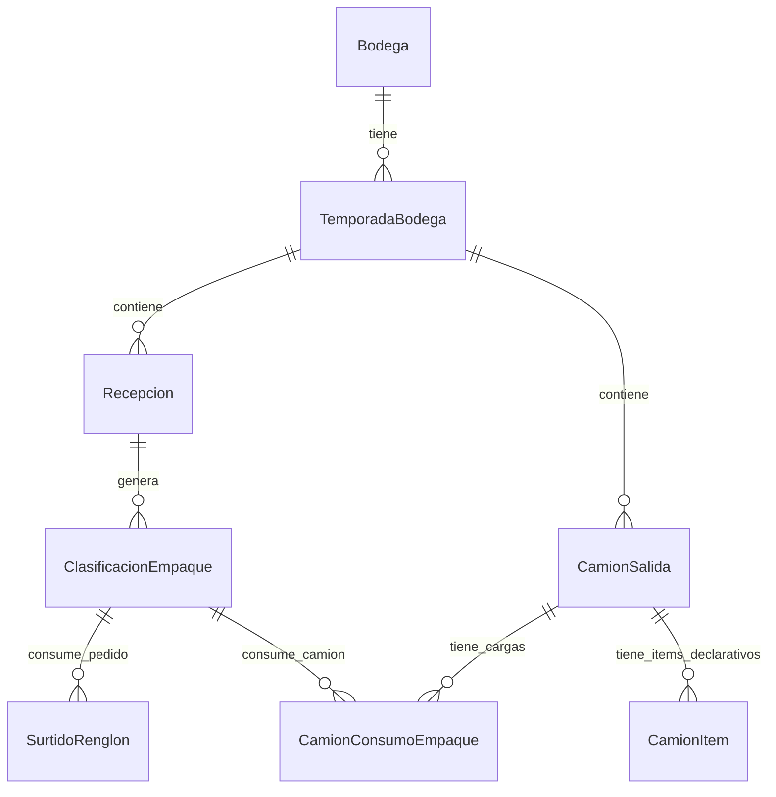
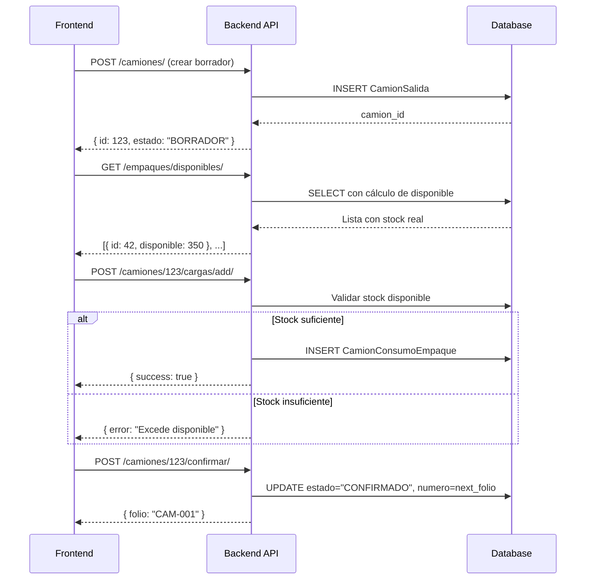

# 📋 Informe Completo de Implementación: Trazabilidad + Stock Real (Camiones de Salida)

**Fecha**: 2025-12-31  
**Módulo**: `gestion_bodega` (Agroproductores Risol)  
**Alcance**: Fases 1 y 2 del Plan de Acción

---

## 1. Resumen Ejecutivo

Se transformó el sistema de logística de camiones de un modelo **declarativo** (donde los usuarios ingresaban datos sin validación de inventario) a un modelo **controlado por stock real** con trazabilidad de origen.

### Objetivos Alcanzados

| Fase | Descripción | Estado |
|------|-------------|--------|
| **Análisis** | Estudio de modelos existentes y arquitectura | ✅ Completado |
| **Fase 1** | Lote Interno Manual + UI básica | ✅ Completado |
| **Fase 2** | Consumo Real de Stock + Validación | ✅ Completado |
| Fase 3 | Guardrails (Inmutabilidad post-confirmación) | ⏳ Pendiente |
| Fase 4 | Reportes de Despacho | ⏳ Pendiente |
| Fase 5 | Mejoras UX | ⏳ Pendiente |

---

## 2. Análisis del Sistema Existente

### 2.1 Modelos Backend Analizados



#### Hallazgos Clave:
- [CamionItem](file:///c:/Users/Yahir/agroproductores_risol/backend/gestion_bodega/models.py#1052-1081): Modelo **declarativo** (no descuenta stock).
- [SurtidoRenglon](file:///c:/Users/Yahir/agroproductores_risol/backend/gestion_bodega/models.py#937-982): Consumo existente para **Pedidos** (bien implementado).
- **Faltante**: Modelo de consumo real para camiones.

### 2.2 Flujo de Datos Identificado

```
Recepción (cajas_campo) 
    → Clasificación/Empaque (cantidad_cajas por material/calidad)
        → Stock Disponible = cantidad_cajas - Surtidos - ConsumosCamión
```

---

## 3. Implementación Detallada

### 3.1 Fase 1: Trazabilidad por Lote Interno Manual

#### Backend: Nuevo Modelo [LoteBodega](file:///c:/Users/Yahir/agroproductores_risol/backend/gestion_bodega/models.py#404-437)

```python
# backend/gestion_bodega/models.py
class LoteBodega(TimeStampedModel):
    bodega = models.ForeignKey(Bodega, on_delete=models.PROTECT, related_name="lotes")
    temporada = models.ForeignKey(TemporadaBodega, on_delete=models.CASCADE, related_name="lotes")
    semana = models.ForeignKey("CierreSemanal", on_delete=models.PROTECT, related_name="lotes_creados")
    codigo_lote = models.CharField(max_length=50)
    origen_nombre = models.CharField(max_length=120, blank=True, default="")

    class Meta:
        constraints = [
            UniqueConstraint(
                fields=["bodega", "temporada", "codigo_lote"],
                name="uniq_lote_codigo_por_temporada"
            )
        ]
```

**Integridad Garantizada**:
- Código único por bodega+temporada.
- Vinculado a semana para contexto temporal.
- Propagación a [Recepcion](file:///c:/Users/Yahir/agroproductores_risol/backend/gestion_bodega/models.py#439-568) y [ClasificacionEmpaque](file:///c:/Users/Yahir/agroproductores_risol/backend/gestion_bodega/models.py#570-701) via FK [lote](file:///c:/Users/Yahir/agroproductores_risol/backend/gestion_bodega/serializers.py#366-421).

#### Serializer: Resolución Automática de Lotes

```python
# backend/gestion_bodega/serializers.py - RecepcionSerializer
def _resolve_lote(self, validated_data):
    codigo = validated_data.pop("codigo_lote", "")
    if not codigo:
        return None
    # Buscar existente o crear nuevo
    lote, created = LoteBodega.objects.get_or_create(
        bodega=bodega, temporada=temporada, codigo_lote=codigo,
        defaults={"semana": semana, "origen_nombre": huertero_nombre}
    )
    return lote
```

---

### 3.2 Fase 2: Consumo Real de Stock (Camiones)

#### Backend: Nuevo Modelo [CamionConsumoEmpaque](file:///c:/Users/Yahir/agroproductores_risol/backend/gestion_bodega/models.py#1084-1115)

```python
# backend/gestion_bodega/models.py
class CamionConsumoEmpaque(TimeStampedModel):
    """
    Consumo REAL de stock empacado.
    Resta disponibilidad: disponible = Clasificacion.cantidad - Surtidos - CargasCamion.
    """
    camion = models.ForeignKey(CamionSalida, on_delete=models.CASCADE, related_name="cargas")
    clasificacion_empaque = models.ForeignKey(ClasificacionEmpaque, on_delete=models.PROTECT, related_name="consumos_camion")
    cantidad = models.PositiveIntegerField()

    class Meta:
        indexes = [
            Index(fields=["camion", "clasificacion_empaque"], name="idx_cce_camion_clasif"),
        ]
```

#### Utilidades de Inventario: [inventario_empaque.py](file:///c:/Users/Yahir/agroproductores_risol/backend/gestion_bodega/utils/inventario_empaque.py)

```python
# backend/gestion_bodega/utils/inventario_empaque.py

def get_disponible_for_clasificacion(clasificacion_id: int) -> int:
    """
    Disponible = Cantidad Total - (Surtidos + ConsumosCamion)
    """
    obj = ClasificacionEmpaque.objects.get(pk=clasificacion_id)
    total = obj.cantidad_cajas or 0
    
    # Consumo por Pedidos (Surtidos)
    surtido = SurtidoRenglon.objects.filter(
        origen_clasificacion_id=clasificacion_id,
        is_active=True
    ).aggregate(t=Sum("cantidad"))["t"] or 0
    
    # Consumo por Camiones
    camiones = CamionConsumoEmpaque.objects.filter(
        clasificacion_empaque_id=clasificacion_id,
        is_active=True
    ).aggregate(t=Sum("cantidad"))["t"] or 0
    
    return max(0, total - (surtido + camiones))

def validate_consumo_camion(clasificacion_id: int, cantidad: int, exclude_id: int = None):
    """Valida que la cantidad solicitada no exceda el stock disponible."""
    disponible = get_disponible_for_clasificacion(clasificacion_id)
    if cantidad > disponible:
        raise ValueError(f"Excede stock disponible ({disponible} cajas)")
```

**Robustez**:
- `exclude_id` permite edición sin doble-conteo.
- Filtro `is_active=True` respeta soft-delete.
- `max(0, ...)` previene valores negativos.

#### Serializer: Validación en Tiempo Real

```python
# backend/gestion_bodega/serializers.py - CamionConsumoEmpaqueSerializer
def validate(self, data):
    cantidad = data.get("cantidad")
    clasif = data.get("clasificacion_empaque")
    
    if cantidad <= 0:
        raise serializers.ValidationError({"cantidad": "Debe ser mayor a 0."})

    from gestion_bodega.utils.inventario_empaque import validate_consumo_camion
    try:
        exclude = self.instance.pk if self.instance else None
        validate_consumo_camion(clasif.pk, cantidad, exclude_id=exclude)
    except ValueError as e:
        raise serializers.ValidationError({"cantidad": str(e)})
    return data
```

#### Views: Endpoints de Gestión de Cargas

```python
# backend/gestion_bodega/views/camiones_views.py
class CamionSalidaViewSet(BaseViewSet):
    
    @action(detail=True, methods=["post"], url_path="cargas/add")
    def add_carga(self, request, pk=None):
        """POST /bodega/camiones/{id}/cargas/add/"""
        obj = self.get_object()
        data = {**request.data, "camion": obj.id}
        ser = CamionConsumoEmpaqueSerializer(data=data)
        ser.is_valid(raise_exception=True)
        
        # Validar semana no cerrada
        if _semana_cerrada(obj.bodega_id, obj.temporada_id, obj.fecha_salida):
            return self.notify(key="camion_semana_cerrada", status_code=409)
        
        with transaction.atomic():
            carga = ser.save()
        return self.notify(key="camion_carga_creada", data={"carga": ...}, status_code=201)

    @action(detail=True, methods=["post"], url_path="cargas/remove")
    def remove_carga(self, request, pk=None):
        """POST /bodega/camiones/{id}/cargas/remove/"""
        carga_id = request.data.get("carga_id")
        carga = CamionConsumoEmpaque.objects.get(pk=carga_id, camion=obj)
        carga.delete()  # Hard delete para liberar stock inmediatamente
        return self.notify(key="camion_carga_eliminada", status_code=200)
```

#### Views: Stock Disponible para Selectores

```python
# backend/gestion_bodega/views/empaques_views.py
class ClasificacionEmpaqueViewSet(BaseViewSet):
    
    @action(detail=False, methods=["get"])
    def disponibles(self, request):
        """GET /bodega/empaques/disponibles/?bodega_id=X&temporada_id=Y"""
        qs = self.filter_queryset(self.get_queryset())
        qs = qs.filter(is_active=True, cantidad_cajas__gt=0)
        
        results = []
        for obj in qs:
            dispo = get_disponible_for_clasificacion(obj.id)
            if dispo > 0:
                data = self.get_serializer(obj).data
                data["disponible"] = dispo
                results.append(data)
        
        return self.notify(key="stock_disponible_fetched", data={"results": results})
```

---

### 3.3 Frontend: UI de Camiones con Stock Real

#### Servicio: [camionesService.ts](file:///c:/Users/Yahir/agroproductores_risol/frontend/src/modules/gestion_bodega/services/camionesService.ts)

```typescript
// frontend/src/modules/gestion_bodega/services/camionesService.ts
export const camionesService = {
  list: (params?: object) => apiClient.get('/bodega/camiones/', { params }),
  create: (payload: object) => apiClient.post('/bodega/camiones/', payload),
  update: (id: number, payload: object) => apiClient.patch(`/bodega/camiones/${id}/`, payload),
  confirmar: (id: number) => apiClient.post(`/bodega/camiones/${id}/confirmar/`),
  
  // Nuevos endpoints para cargas
  addCarga: async (id: number, payload: { clasificacion_empaque: number; cantidad: number }) => {
    const res = await apiClient.post(`/bodega/camiones/${id}/cargas/add/`, payload);
    return ensureSuccess(res.data);
  },
  removeCarga: async (id: number, cargaId: number) => {
    const res = await apiClient.post(`/bodega/camiones/${id}/cargas/remove/`, { carga_id: cargaId });
    return ensureSuccess(res.data);
  },
};
```

#### Componente: [CamionFormModal.tsx](file:///c:/Users/Yahir/agroproductores_risol/frontend/src/modules/gestion_bodega/components/logistica/CamionFormModal.tsx)

- **Estado**: Formik + Yup para validación de cabecera (placas, chofer, destino, etc.).
- **Carga de Datos**: `useEffect` carga detalles completos (incluyendo `cargas`) al abrir en modo edición.
- **Flujo de Creación**: Al crear, el modal **permanece abierto** para permitir agregar cargas inmediatamente.
- **Confirmación**: Botón "Confirmar Salida" asigna folio correlativo y bloquea edición.

```tsx
// Payload corregido para backend
const payload = {
  ...values,
  bodega_id: bodegaId,      // ← Clave correcta
  temporada_id: temporadaId, // ← Clave correcta
};
```

#### Componente: [CamionCargasEditor.tsx](file:///c:/Users/Yahir/agroproductores_risol/frontend/src/modules/gestion_bodega/components/logistica/CamionCargasEditor.tsx)

```tsx
// Selector de stock disponible con validación en tiempo real
const handleAddCarga = async () => {
  if (!selectedClasif || cantidad <= 0) return;

  const clasifData = disponibles.find(d => d.id === selectedClasif);
  if (cantidad > (clasifData?.disponible || 0)) {
    setError(`Solo hay ${clasifData?.disponible} disponibles`);
    return;
  }

  await camionesService.addCarga(camionId, {
    clasificacion_empaque: selectedClasif,
    cantidad,
  });
  
  onCargasChange(); // Refrescar lista
};
```

---

## 4. Integridad de Datos y Validaciones

### 4.1 Reglas de Negocio Implementadas

| Regla | Ubicación | Implementación |
|-------|-----------|----------------|
| Stock no puede ser negativo | [inventario_empaque.py](file:///c:/Users/Yahir/agroproductores_risol/backend/gestion_bodega/utils/inventario_empaque.py) | `max(0, total - consumo)` |
| Carga no puede exceder disponible | [CamionConsumoEmpaqueSerializer](file:///c:/Users/Yahir/agroproductores_risol/backend/gestion_bodega/serializers.py#949-980) | [validate_consumo_camion()](file:///c:/Users/Yahir/agroproductores_risol/backend/gestion_bodega/utils/inventario_empaque.py#30-50) |
| Semana cerrada bloquea operaciones | [camiones_views.py](file:///c:/Users/Yahir/agroproductores_risol/backend/gestion_bodega/views/camiones_views.py) | [_semana_cerrada()](file:///c:/Users/Yahir/agroproductores_risol/backend/gestion_bodega/views/camiones_views.py#45-50) check |
| Fecha solo HOY o AYER | [CamionSalidaSerializer](file:///c:/Users/Yahir/agroproductores_risol/backend/gestion_bodega/serializers.py#982-1016) | [_is_today_or_yesterday()](file:///c:/Users/Yahir/agroproductores_risol/backend/gestion_bodega/serializers.py#81-84) |
| Temporada activa requerida | [CamionSalidaSerializer](file:///c:/Users/Yahir/agroproductores_risol/backend/gestion_bodega/serializers.py#982-1016) | [_temporada_activa()](file:///c:/Users/Yahir/agroproductores_risol/backend/gestion_bodega/serializers.py#95-97) |
| Bodega activa requerida | Modelo [clean()](file:///c:/Users/Yahir/agroproductores_risol/backend/gestion_bodega/models.py#733-741) | [_assert_bodega_temporada_operables()](file:///c:/Users/Yahir/agroproductores_risol/backend/gestion_bodega/serializers.py#98-113) |

### 4.2 Consistencia de Claves Foráneas

```python
# Validación cruzada en CamionConsumoEmpaque
def clean(self):
    if self.clasificacion_empaque.bodega_id != self.camion.bodega_id:
        raise ValidationError("La clasificación no pertenece a esta bodega")
    if self.clasificacion_empaque.temporada_id != self.camion.temporada_id:
        raise ValidationError("La clasificación no pertenece a esta temporada")
```

### 4.3 Transacciones Atómicas

```python
# Todas las operaciones de consumo son atómicas
with transaction.atomic():
    carga = ser.save()
    # Si falla validación, todo el bloque se revierte
```

---

## 5. API Contracts

### Crear Camión
```http
POST /api/bodega/camiones/
Content-Type: application/json

{
  "bodega_id": 1,
  "temporada_id": 1,
  "placas": "ABC-123",
  "chofer": "Juan Pérez",
  "destino": "CDMX",
  "receptor": "Cliente X",
  "fecha_salida": "2025-12-31",
  "observaciones": ""
}
```

### Agregar Carga
```http
POST /api/bodega/camiones/{id}/cargas/add/
Content-Type: application/json

{
  "clasificacion_id": 42,
  "cantidad": 100
}
```

### Obtener Stock Disponible
```http
GET /api/bodega/empaques/disponibles/?bodega_id=1&temporada_id=1

Response:
{
  "success": true,
  "data": {
    "results": [
      {
        "id": 42,
        "material": "PLASTICO",
        "calidad": "PRIMERA",
        "tipo_mango": "KENT",
        "cantidad_cajas": 500,
        "disponible": 350,  // ← Calculado en tiempo real
        "lote_codigo": "LOTE-001"
      }
    ]
  }
}
```

---

## 6. Correcciones de Errores Durante Implementación

### 6.1 Error de Import `empaquesService`
- **Problema**: [CamionCargasEditor.tsx](file:///c:/Users/Yahir/agroproductores_risol/frontend/src/modules/gestion_bodega/components/logistica/CamionCargasEditor.tsx) usaba import default pero era named export.
- **Solución**: Cambiar a `import { empaquesService } from '...'`.

### 6.2 Error de Payload Keys
- **Problema**: Frontend enviaba [bodega](file:///c:/Users/Yahir/agroproductores_risol/backend/gestion_bodega/serializers.py#246-250)/[temporada](file:///c:/Users/Yahir/agroproductores_risol/backend/gestion_bodega/serializers.py#95-97) pero backend esperaba `bodega_id`/`temporada_id`.
- **Solución**: Actualizar payload en [CamionFormModal.tsx](file:///c:/Users/Yahir/agroproductores_risol/frontend/src/modules/gestion_bodega/components/logistica/CamionFormModal.tsx).

### 6.3 Lint: Grid Component Type Errors
- **Problema**: MUI v6 Grid requiere `component="div"` pero rechaza [item](file:///c:/Users/Yahir/agroproductores_risol/backend/gestion_bodega/views/camiones_views.py#165-181) prop.
- **Solución**: Refactorizar a `Box` con CSS Grid.

---

## 7. Archivos Modificados

### Backend
| Archivo | Cambios |
|---------|---------|
| [models.py](file:///c:/Users/Yahir/agroproductores_risol/backend/gestion_bodega/models.py) | +[LoteBodega](file:///c:/Users/Yahir/agroproductores_risol/backend/gestion_bodega/models.py#404-437), +[CamionConsumoEmpaque](file:///c:/Users/Yahir/agroproductores_risol/backend/gestion_bodega/models.py#1084-1115), Lote FK en Recepcion/Clasificacion |
| [serializers.py](file:///c:/Users/Yahir/agroproductores_risol/backend/gestion_bodega/serializers.py) | +[CamionConsumoEmpaqueSerializer](file:///c:/Users/Yahir/agroproductores_risol/backend/gestion_bodega/serializers.py#949-980), [_resolve_lote()](file:///c:/Users/Yahir/agroproductores_risol/backend/gestion_bodega/serializers.py#366-421) en RecepcionSerializer |
| [views/camiones_views.py](file:///c:/Users/Yahir/agroproductores_risol/backend/gestion_bodega/views/camiones_views.py) | +[add_carga](file:///c:/Users/Yahir/agroproductores_risol/backend/gestion_bodega/views/camiones_views.py#203-221), +[remove_carga](file:///c:/Users/Yahir/agroproductores_risol/backend/gestion_bodega/views/camiones_views.py#222-244) actions |
| [views/empaques_views.py](file:///c:/Users/Yahir/agroproductores_risol/backend/gestion_bodega/views/empaques_views.py) | +[disponibles](file:///c:/Users/Yahir/agroproductores_risol/backend/gestion_bodega/views/empaques_views.py#178-205) action |
| [utils/inventario_empaque.py](file:///c:/Users/Yahir/agroproductores_risol/backend/gestion_bodega/utils/inventario_empaque.py) | +[get_disponible_for_clasificacion()](file:///c:/Users/Yahir/agroproductores_risol/backend/gestion_bodega/utils/inventario_empaque.py#4-29), +[validate_consumo_camion()](file:///c:/Users/Yahir/agroproductores_risol/backend/gestion_bodega/utils/inventario_empaque.py#30-50) |

### Frontend
| Archivo | Cambios |
|---------|---------|
| [camionesService.ts](file:///c:/Users/Yahir/agroproductores_risol/frontend/src/modules/gestion_bodega/services/camionesService.ts) | +[addCarga](file:///c:/Users/Yahir/agroproductores_risol/frontend/src/modules/gestion_bodega/services/camionesService.ts#38-43), +[removeCarga](file:///c:/Users/Yahir/agroproductores_risol/frontend/src/modules/gestion_bodega/services/camionesService.ts#43-47) methods |
| [empaquesService.ts](file:///c:/Users/Yahir/agroproductores_risol/frontend/src/modules/gestion_bodega/services/empaquesService.ts) | +[listDisponibles](file:///c:/Users/Yahir/agroproductores_risol/frontend/src/modules/gestion_bodega/services/empaquesService.ts#201-212) method |
| [CamionFormModal.tsx](file:///c:/Users/Yahir/agroproductores_risol/frontend/src/modules/gestion_bodega/components/logistica/CamionFormModal.tsx) | Nuevo componente con Formik, carga de datos, integración con CargasEditor |
| [CamionCargasEditor.tsx](file:///c:/Users/Yahir/agroproductores_risol/frontend/src/modules/gestion_bodega/components/logistica/CamionCargasEditor.tsx) | Nuevo componente: selector de stock, validación en tiempo real |
| [LogisticaSection.tsx](file:///c:/Users/Yahir/agroproductores_risol/frontend/src/modules/gestion_bodega/components/tablero/sections/LogisticaSection.tsx) | Botón "Agregar Camión", click handler para editar |
| [TableroBodegaPage.tsx](file:///c:/Users/Yahir/agroproductores_risol/frontend/src/modules/gestion_bodega/pages/TableroBodegaPage.tsx) | Estado y handlers para modal, integración con LogisticaSection |

---

## 8. Próximos Pasos (Fases Pendientes)

### Fase 3: Guardrails
- [ ] Bloquear edición de camión con estado `CONFIRMADO`.
- [ ] Validar que existan cargas antes de confirmar (config opcional).
- [ ] Implementar anulación de camión (soft-delete con liberación de stock).

### Fase 4: Reportes
- [ ] Actualizar reporte semanal para incluir columna "Despachado".
- [ ] Reporte de trazabilidad por lote.

### Fase 5: UX
- [ ] Autocompletar para selector de clasificaciones.
- [ ] Indicadores visuales de stock bajo.
- [ ] Confirmación con resumen antes de salida.

---

## 9. Diagrama de Flujo Final



---

**Documento generado automáticamente** | Última actualización: 2025-12-31T06:10:07-06:00
